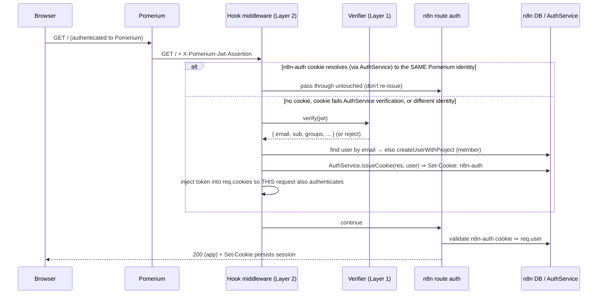

# n8n + Pomerium identity bridge — design

> Status: **decisions locked — ready to implement** (build order in [§13](#13-build-order-test-first)).
> [§14](#14-open-decisions) records the choices taken. Findings are grounded in n8n source at
> **2.27.x** (Express 5.1, `@n8n/di`); file paths and internal APIs below are real but
> upstream-version-sensitive — see [§11](#11-upgrade-fragility-strategy).

## 1. Goal & scope

Run **upstream `n8nio/n8n`** (Community Edition) behind **Pomerium** so that Pomerium is the
sole identity layer. A small **external hook**, loaded into an otherwise-unmodified n8n image:

1. reads a Pomerium-signed identity JWT from a request header,
2. verifies it against Pomerium's JWKS (signature, issuer, audience, expiry, algorithm),
3. maps the trusted identity to an n8n user (just-in-time provisioning if new), and
4. issues an n8n-native session cookie so the rest of n8n treats the request as logged in.

The repo stays narrow: **the hook is the only product source.** Everything else — Docker, CI,
e2e, Renovate — is plumbing that wraps it. A patched image tracks upstream automatically and
auto-publishes **only while the e2e suite proves the mechanism still works**.

### Goals

- Transparent SSO: a user already authenticated by Pomerium lands in n8n logged in, no n8n login page.
- **Generic by construction**: verify _any_ OAuth/OIDC JWT against a JWKS with an **issuer allow-list**; Pomerium is the default preset, not a special case.
- Autonomous upkeep: Renovate bumps n8n, CI rebuilds, e2e gates, image auto-publishes — hands-off as long as it keeps working.
- e2e harness is first-class and **written test-first** (red before the hook exists).

### Non-goals

- Replacing n8n Enterprise SSO (SAML/OIDC) feature-for-feature (group→role sync, SCIM, etc.).
- Acting as the OAuth client / doing the OIDC dance ourselves — Pomerium (or another proxy) already did it. We only _consume and verify_ its assertion.
- Supporting n8n's `queue`/multi-main internals beyond what the hook needs.
- Patching n8n source. We add a hook; we never fork.

## 2. Current repository state

| Area                                 | State                                                                                                                                                                                       |
| ------------------------------------ | ------------------------------------------------------------------------------------------------------------------------------------------------------------------------------------------- |
| `src/pomerium-session-hook.ts`       | **Layer-1 verifier exists**: `createPomeriumJwtVerifier({ jwksUrl, issuer, audience })` → verifies via `jose`, returns `{ subject, email, name, groups, claims }`. Pure, no n8n dependency. |
| `test/pomerium-session-hook.test.ts` | Hermetic unit tests using `jose`'s `customFetch` to mock the JWKS; covers happy path + wrong-issuer rejection.                                                                              |
| Tooling                              | TypeScript (strict, `exactOptionalPropertyTypes`), **tsup → CJS** (`--format cjs`), vitest, eslint strict-type-checked, prettier, pnpm 11 via corepack, Node ≥24, `jose@6.2.3` pinned.      |
| Missing (this design)                | the n8n-coupled hook entrypoint, generic issuer registry, Dockerfile, e2e harness, CI, Renovate. README calls these "the next layer."                                                       |

The CJS build target is significant: n8n loads hooks with `require()`, so the shipped artifact
**must** be CommonJS. The existing `tsup --format cjs` is already correct for that.

## 3. Background: the gap we're filling

- **n8n Community has no header/forward-auth SSO.** Native SAML/OIDC live in
  `packages/cli/src/modules/sso-*` and are **Enterprise-licensed**. There is no built-in "trust an
  upstream proxy" mode. The external-hook route is the established community workaround.
- **n8n auth is a per-route cookie check.** There is **no single global auth middleware**.
  `ControllerRegistry.buildMiddlewares()` attaches `AuthService.createAuthMiddleware()` to _each_
  controller route (`packages/cli/src/controller.registry.ts`). The check reads the `n8n-auth`
  cookie (`AUTH_COOKIE_NAME`, `constants.ts`), validates a **HS256 JWT**, loads `req.user`, and on
  failure returns **`401` JSON** (`auth/auth.service.ts`). The login _page_ is pure SPA behavior:
  the UI calls `/rest/login`, gets 401, and client-routes to `/signin`.
- **Pomerium** signs an identity assertion and forwards it as a header. We verify that signature
  rather than trusting a plaintext header — see [§7](#7-security-model) for why that materially
  improves the threat model versus typical "trust `Remote-Email`" SSO shims.

## 4. Architecture

```
        ┌───────────┐    OIDC/OAuth     ┌──────────────┐
        │  Browser  │ ◀───── login ────▶│   Pomerium   │  (identity-aware proxy)
        └─────┬─────┘                   │  + IdP       │
              │  request + cookies      └──────┬───────┘
              │                                │ injects  X-Pomerium-Jwt-Assertion: <ES256 JWT>
              ▼                                ▼ strips client-supplied copies of that header
        ┌──────────────────────────────────────────────────────┐
        │  Patched n8n image  =  n8nio/n8n  +  our hook (CJS)    │
        │                                                        │
        │   Express stack (per request):                        │
        │     cookieParser ─▶ [OUR MIDDLEWARE] ─▶ n8n routes     │
        │                          │                 │ per-route │
        │                          │                 │ auth reads│
        │                          ▼                 ▼ n8n-auth  │
        │              verify JWT (Layer 1)     AuthService      │
        │              find/provision user      validates cookie │
        │              issue n8n-auth cookie    → req.user       │
        └──────────────────────────────────────────────────────┘
                         │ resolves at runtime via @n8n/di
                         ▼
                  AuthService, UserRepository (n8n internals)
```

The hook splits cleanly into two layers; this split is the backbone of the whole testing story.

### Layer 1 — identity verification core (pure, unit-tested here)

No n8n dependency. Input: a raw JWT string + config. Output: a verified identity or a rejection.
Owns: JWKS fetch/cache, **issuer allow-list**, audience/expiry/`nbf` checks, **algorithm pinning**,
claim→identity mapping. This is the existing `createPomeriumJwtVerifier`, generalized in
[§5.1](#51-layer-1-generic-identity-verifier). Fully testable in-repo with mocked JWKS — and it's
where the security-critical logic lives.

### Layer 2 — n8n session adapter (n8n-coupled, e2e-tested only)

The actual external hook entrypoint. Imports n8n internals **at runtime** (they only exist inside
the image), splices Express middleware, calls Layer 1, provisions the user, and issues the cookie.
It cannot be unit-tested in this repo (no n8n runtime), so **its test is the e2e suite against the
real image** ([§9](#9-e2e-test-harness)). This is also the layer that breaks on upstream refactors —
which is exactly why the e2e gate guards every auto-update.

### Request flow (happy path)



## 5. Component design

### 5.1 Layer 1: generic identity verifier

Generalize the current single-issuer verifier into a **trusted-issuer registry**. Each issuer is
fully self-describing; verification selects the issuer by the token's (unverified) `iss`, then
verifies against _that_ issuer's pinned config. Nothing from an unverified token is trusted beyond
selecting which allow-listed config to apply.

```ts
interface TrustedIssuer {
  issuer: string; // exact `iss` to match (allow-list membership)
  jwksUri: string; // explicit JWKS URI (or discovered from OIDC well-known)
  audiences: string[]; // accepted `aud` values for this issuer
  algorithms: string[]; // pinned alg allow-list, e.g. ['ES256'] — NEVER read alg from token
  identityClaim: string; // claim carrying the n8n login identity (default 'email')
  groupsClaim?: string; // default 'groups'
  nameClaim?: string; // default 'name'
  requiredGroups?: string[]; // optional coarse authorization gate
}

interface ProxyAuthConfig {
  issuers: TrustedIssuer[];
  sourceHeaders: string[]; // ordered; first header yielding a verifying token wins
  clockToleranceSec: number; // default 60
}
```

Verification algorithm:

1. Extract a candidate token from the **first** configured `sourceHeaders` entry that has a value
   (strip `Bearer ` for `authorization`). Default order:
   `['x-pomerium-jwt-assertion', 'authorization', 'x-forwarded-access-token', 'x-auth-request-access-token', 'x-forwarded-id-token']`.
2. `decodeJwt` (no verification) only to read `iss`; select the matching `TrustedIssuer` from the
   allow-list. **Reject immediately if `iss` is not allow-listed.**
3. `jwtVerify(token, jwks, { issuer, audience: audiences, algorithms, clockTolerance })`, where
   `jwks` is a per-issuer cached `createRemoteJWKSet`.
4. Map `payload[identityClaim] → identity`; enforce `requiredGroups` if set; optionally require
   `email_verified === true` when the identity claim is an email.

`jose` recipe (matches pinned `jose@6.2.3`):

```ts
const jwks = createRemoteJWKSet(new URL(issuer.jwksUri), {
  cacheMaxAge: 600_000,
  cooldownDuration: 30_000,
  timeoutDuration: 5_000,
});
const { payload } = await jwtVerify(token, jwks, {
  issuer: issuer.issuer,
  audience: issuer.audiences,
  algorithms: issuer.algorithms, // CRITICAL — see §7
  clockTolerance: '60s',
});
```

`createRemoteJWKSet` lazily refetches on unknown `kid` (rate-limited by `cooldownDuration`), so key
rotation is automatic. `jose` never accepts `alg: none`, and pinning `algorithms` defeats RS256→HS256
confusion. The **Pomerium preset** is just one `TrustedIssuer` with `algorithms: ['ES256']`,
`jwksUri` = `https://<route-host>/.well-known/pomerium/jwks.json`, `identityClaim: 'email'`.

The existing `createPomeriumJwtVerifier` becomes a thin preset over this generic core; its tests
stay valid. New unit tests cover: issuer allow-list rejection, `aud` mismatch, expired/`nbf`,
algorithm-not-pinned rejection, multi-issuer selection, header precedence, group gating.

### 5.2 Layer 2: the n8n external hook

**Loading.** n8n reads `EXTERNAL_HOOK_FILES` (colon-separated absolute paths; **not**
`N8N_EXTERNAL_HOOK_FILES` — that name does not exist). A hook file exports the
`{ scope: { event: [fn, ...] } }` shape; we use `n8n.ready`:

```js
// built artifact (CJS) — the ONE file n8n loads
module.exports = {
  n8n: {
    ready: [
      async function (server /* AbstractServer */, _config) {
        installProxyAuth(server.app, loadConfigFromEnv());
      },
    ],
  },
};
```

`n8n.ready` is called at `packages/cli/src/abstract-server.ts` as
`externalHooks.run('n8n.ready', [this, config])` — **first arg is the `AbstractServer`**; reach
Express via `server.app`.

**The ordering problem (the crux).** `n8n.ready` fires _after_ `configure()` has already mounted
every controller router with its per-route auth. A plain `server.app.use(mw)` therefore registers
**last** and runs _after_ auth — too late to authenticate the request. There is no global auth
middleware to "register before."

**The mechanism.** Splice our middleware into the Express **router stack** immediately after the
`cookieParser` layer, so it runs before any route handler:

```js
function installProxyAuth(app, config) {
  const verify = createVerifier(config); // Layer 1
  const stack = app.router.stack; // Express 5 (n8n ≥1.87). Was app._router in Express 4.
  const i = stack.findIndex((l) => l.name === 'cookieParser');
  const Layer = stack[i].constructor; // reuse the live Layer ctor — see §11
  stack.splice(i + 1, 0, new Layer('/', {}, makeMiddleware(verify, config)));
}
```

`makeMiddleware` per request:

1. If an `n8n-auth` cookie is present, **reconcile it against the Pomerium identity** rather than
   blindly passing through. Resolve the cookie through n8n's **own `AuthService`** —
   `validateCookieToken(token)`, the public, side-effect-free primitive that returns the cookie
   `User` with `email` and the `role` relation loaded (no `res`, no `browserId`/MFA gate, no refresh
   write), obtained via the anchored `createRequire`. Normalize its email (trim + lowercase) and
   compare to the verified Pomerium identity (also normalized). If they **match** → `next()` (don't
   re-issue). If they **differ**, or the cookie fails n8n's own verification (`validateCookieToken`
   throws) → fall through to the header path and issue a fresh cookie for the Pomerium identity.
   Using `AuthService` — not cookie-payload decoding, and **not** `resolveJwt` (which enforces
   `browserId` and writes a refresh cookie to `res`) — keeps this consistent with
   [§14](#14-open-decisions) D1/D6.
2. Else read the configured header; if absent → `next()` (let n8n 401/redirect as usual).
3. Verify via Layer 1. On failure → `next()` (treated as unauthenticated; never 500 the request).
4. Find user by mapped identity — the **normalized (trim + lowercase) email**, the same value used
   for the reconcile comparison in step 1 and for JIT-create — requiring a verified email when keying
   the account; if none and provisioning enabled →
   `UserRepository.createUserWithProject({ email, firstName, lastName, role: GLOBAL_MEMBER_ROLE, password: 'no password set', authIdentities: [] })` (creates user + personal project, mirroring `OidcService.loginUser`).
5. `AuthService.issueCookie(res, user, /*usedMfa*/ true, /*browserId*/ undefined)` → sets
   `Set-Cookie: n8n-auth`. **`user.role` must be loaded** or `issueCookie` can throw a user-quota
   error for non-owners.
6. Inject the freshly minted token into `req.cookies['n8n-auth']` so the **current** request also
   passes downstream per-route auth (no redirect round-trip needed).

**Resolving n8n internals at runtime.** Hooks run inside the n8n process, so the DI container is
live: `const { Container } = require('@n8n/di'); Container.get(AuthService)`. We resolve
`AuthService`, `UserRepository`, and the role constants lazily (inside `n8n.ready`, not at module
top-level) and keep all n8n imports behind `require()` so Layer 1 stays clean and this repo never
needs n8n as a dependency. Issuing via `AuthService` (rather than forging the HS256 JWT ourselves)
means we don't replicate n8n's cookie payload, `hash` derivation, or signing-secret resolution — n8n
does it correctly and we inherit changes for free. (Recommended; see [§14](#14-open-decisions) D1.)

**Owner-setup gate.** A fresh instance seeds a _shell owner_ and blocks the UI behind `/setup`
until `userManagement.isInstanceOwnerSetUp` flips (only `OwnershipService.setupOwner` flips it).
JIT-provisioning a member does **not** flip it. So: the instance owner is established **once**,
out of band (normal setup, or a seeded fixture in e2e); thereafter the hook provisions SSO users as
members. The hook does **not** try to make the first Pomerium user the owner. ([§14](#14-open-decisions) D3.)

## 6. Configuration

Provisional env surface (prefix open — [§14](#14-open-decisions) D5). Simple single-issuer/preset form:

| Env var                         | Default                    | Meaning                                                              |
| ------------------------------- | -------------------------- | -------------------------------------------------------------------- |
| `N8N_PROXY_AUTH_JWKS_URL`       | —                          | JWKS URI (Pomerium: `https://<host>/.well-known/pomerium/jwks.json`) |
| `N8N_PROXY_AUTH_ISSUER`         | —                          | expected `iss` (allow-list of one)                                   |
| `N8N_PROXY_AUTH_AUDIENCE`       | —                          | expected `aud` (route hostname for Pomerium)                         |
| `N8N_PROXY_AUTH_ALGORITHMS`     | `ES256`                    | pinned algorithm allow-list (comma-sep)                              |
| `N8N_PROXY_AUTH_HEADER`         | `x-pomerium-jwt-assertion` | source header(s), comma-sep, ordered                                 |
| `N8N_PROXY_AUTH_EMAIL_CLAIM`    | `email`                    | identity claim                                                       |
| `N8N_PROXY_AUTH_AUTO_PROVISION` | `true`                     | JIT-create unknown users                                             |

Advanced multi-issuer form: `N8N_PROXY_AUTH_ISSUERS=<path-to-json>` pointing at a file of
`TrustedIssuer[]`. The simple vars are sugar that desugar to a one-element registry.

The provisioned role is **fixed to `global:member`** in v1 (D3 / constraint 3: every verified
identity is provisioned as `global:member`, with no n8n-side allow-list — Pomerium is the access
gate). There is intentionally no configurable-role env var: a knob that is parsed but silently
ignored is a foot-gun, so the field does not exist. Configurable provisioning roles are reserved
for a future revision.

## 7. Security model

- **We verify a signature, not a plaintext header.** Typical header-SSO shims trust `Remote-Email`
  and are fully compromised the instant n8n is reachable off-proxy. We instead verify an
  **ES256-signed JWT against Pomerium's JWKS**, so an attacker with direct network access still
  cannot mint a valid assertion without Pomerium's signing key. This is a real improvement, _not_ a
  license to skip defense-in-depth.
- **Still keep n8n proxy-only.** Replay within the token's short validity window (Pomerium
  assertions are ~minutes) remains possible, and headers are only as trustworthy as the hop in
  front. Bind n8n's network so it is reachable **only** via Pomerium, and ensure the proxy
  **strips client-supplied copies** of the source headers on ingress.
- **Pin algorithms — always.** Never derive the accepted `alg` from the token. Pinning defeats
  `alg: none` and RS256→HS256 confusion. Default `['ES256']` for Pomerium.
- **Validate `iss` against a closed allow-list** and `aud` against configured audiences; never
  fetch a JWKS from a URL derived from an untrusted token (`jku`/SSRF).
- **Fail safe.** Any verification error → request proceeds as _unauthenticated_ (n8n's normal
  401/login), never as authenticated and never a 500.
- **Logout semantics.** Because the hook re-issues from a still-valid Pomerium assertion, "log out"
  belongs at Pomerium; an n8n-local logout would immediately re-auth. Document this; optionally add
  a config to honor a logout marker later.
- **Identity-switch / shared-browser semantics.** The hook does **not** trust any existing
  `n8n-auth` cookie on its face. On each request it resolves the cookie through `AuthService` and
  compares the cookie user's normalized email to the verified Pomerium identity; when they differ
  (e.g. a shared browser, or a Pomerium re-login as a different user) it **re-issues** a fresh cookie
  for the current Pomerium identity instead of leaving the stale session in place. This closes the
  identity-switch gap that a naive "any valid cookie passes" check would leave open
  ([§14](#14-open-decisions) D6).
- **Email-collision risk (accepted).** Identity is keyed by the normalized (trim + lowercase) email.
  Two distinct subjects (`sub`) that present the **same** verified email — e.g. across issuers — would
  map to the **same** n8n account. This is an accepted consequence of using email as the account key:
  Pomerium's policy is the access gate, a verified email is required to key an account, and there is
  no `requireVerifiedEmail` opt-out that could break the email-as-account-key invariant. Closed/accepted.
- **Access control is delegated to Pomerium.** v1 ships **no n8n-side allow-list**: every identity
  Pomerium authenticates and whose assertion verifies is JIT-provisioned as `global:member` (never
  `owner`). Pomerium's own policy is the gate for who may reach n8n. The issuer registry keeps an
  optional `requiredGroups` hook latent in the type for later, but it is unset by default.

## 8. Packaging

Single thin Dockerfile; version in an `ARG` so Renovate and the build tagging share one source of truth:

```dockerfile
ARG N8N_VERSION=2.26.8
FROM n8nio/n8n:${N8N_VERSION}
USER root
COPY dist/hook.cjs /opt/proxy-auth/hook.cjs
ENV EXTERNAL_HOOK_FILES=/opt/proxy-auth/hook.cjs
USER node
```

- The build emits a **single CJS hook artifact** — `dist/hook.cjs`, the `EXTERNAL_HOOK_FILES`
  entry that default-exports `{ n8n: { ready: [fn] } }`. There is no separate library artifact.
- The hook is built (`pnpm build` → CJS) **before** the Docker build; only `dist/` is copied in, so
  the image carries no dev toolchain. (`dist/` is gitignored; CI builds it in-pipeline.)
- `@n8n/di`, `AuthService`, etc. resolve from the **base image's** `node_modules` at runtime — we
  ship none of n8n.
- Image tags mirror upstream: our `:2.26.8` ⇆ `n8nio/n8n:2.26.8`, plus `:latest` on the default
  branch. Multi-arch `linux/amd64,linux/arm64` via buildx; provenance + SBOM attestations.
- Published to **GHCR** (`ghcr.io/<owner>/n8n-proxy-auth`). ([§14](#14-open-decisions) D5.)

## 9. E2E test harness

**The priority deliverable, written test-first.** It must validate the real mechanism against the
real patched image, hermetically and deterministically, with no external IdP — and it must be the
**required status check** that gates Renovate auto-merge.

**Topology (docker-compose):**

- `mock-jwks` — tiny container serving a static JWKS (public half of a test keypair) at a fixed URL
  the n8n container can reach. No real Pomerium needed.
- `n8n` — the **patched image built from the PR's Dockerfile**, configured with
  `EXTERNAL_HOOK_FILES` (baked in) and `N8N_PROXY_AUTH_*` pointing at `mock-jwks`, with test
  issuer/audience. SQLite, ephemeral per run.
- **Test driver** (host, reuses repo vitest + `jose`) **plays the role of Pomerium**: it mints JWTs
  with the _private_ half of the test key and sends HTTP requests to n8n with the configured header
  set. This is simpler and more deterministic than running real Pomerium and exercises the exact
  same verification path.

**Fixture:** first establish the instance owner once (POST the owner-setup REST call) so the
instance is past the `/setup` gate; then run SSO scenarios.

**Scenarios (the executable spec):**

1. Valid assertion, unknown user → response carries `Set-Cookie: n8n-auth`; the same request is
   authenticated (a protected `/rest/*` endpoint returns the user, not 401).
2. The issued cookie alone (no header) authenticates a follow-up request.
3. Unknown user was **JIT-provisioned** as a member; a second login with the same email reuses the
   same user (no duplicate).
4. **No header, no cookie** → unauthenticated (401 on `/rest/*`).
5. **Invalid/expired/wrong-issuer/wrong-aud/unpinned-alg** assertion → unauthenticated (Layer-1
   rejection observable end-to-end).
6. Generic mode: assertion from a **non-allow-listed issuer** → rejected even though
   well-formed and validly signed by _its_ key.
7. (Optional UI smoke, later) Playwright: browser hits n8n through a header-injecting shim and lands
   on the workflow canvas, not `/signin`.

**TDD / red-first:** scenarios 1–3 and 6 fail until Layer 2 + the Dockerfile wiring exist (n8n
ignores an absent hook and 401s the header-only request). Scenarios 4–5 should pass even on bare
n8n (they assert _rejection_), guarding against the hook ever authenticating something it shouldn't.

**Optional real-Pomerium integration compose** (`docker-compose.pomerium.yml`): a full
Pomerium + static IdP stack for a manual/scheduled smoke test. Heavier and slower; **not** the
gate. It exists to catch drift in real Pomerium claim/JWKS specifics (`iss`/`aud` exact values),
which the docs state imprecisely and which should be confirmed empirically.

## 10. CI/CD & automation

**One workflow, image built once, two roles** (sketch):

```yaml
on: { pull_request: {}, push: { branches: [main] } }
jobs:
  build-test-publish:
    permissions: { contents: read, packages: write, attestations: write, id-token: write }
    steps:
      - checkout
      - pnpm install && pnpm check # typecheck + lint + format + unit tests + build
      - id: ver # read ARG N8N_VERSION from Dockerfile → drives our image tags
      - buildx build --load tags n8n-proxy-auth:test # from the PR's Dockerfile
      - ./scripts/e2e.sh n8n-proxy-auth:test # compose up mock-jwks + n8n, run scenarios  ← REQUIRED CHECK
      - if push to main: buildx build --push multi-arch → ghcr.io/.../n8n-proxy-auth:${ver},:latest
      - if push to main: attest-build-provenance
```

The PR build runs unit tests **and** e2e against the actual image. The publish step is
`if: github.event_name == 'push'`, so it only runs after a green PR is merged.

**Renovate** (`renovate.json`):

```json
{
  "$schema": "https://docs.renovatebot.com/renovate-schema.json",
  "extends": ["config:recommended"],
  "pinDigests": true,
  "packageRules": [
    {
      "matchDatasources": ["docker"],
      "matchPackageNames": ["n8nio/n8n"],
      "versioning": "semver",
      "allowedVersions": "/^\\d+\\.\\d+\\.\\d+$/",
      "automerge": true,
      "automergeType": "pr",
      "platformAutomerge": true
    }
  ]
}
```

- The `dockerfile` manager bumps the `ARG N8N_VERSION` automatically (Renovate expands `ARG`/`FROM`;
  keep image in `FROM`, version in `ARG`).
- `versioning: semver` + `allowedVersions: /^\d+\.\d+\.\d+$/` follows **stable** releases only —
  excludes `next`, `beta`, `latest`, and `2.x.y-<sha>` tags.
- `pinDigests` makes builds reproducible and produces digest-bump PRs too.
- **Auto-merge is gated by CI by design**: Renovate won't merge until status checks are green.

**Branch protection is mandatory, not optional.** With `platformAutomerge`, GitHub may merge a PR
with no required checks — so the default branch **must** require the `build-test-publish` (e2e) check.
That required check _is_ the safety interlock: bad upstream bump → e2e red → merge blocked →
last-good image stays published. ([§14](#14-open-decisions) D5 covers Mend-app vs self-hosted Renovate.)

## 11. Upgrade-fragility strategy

Layer 2 deliberately touches **unstable n8n internals**, ranked by fragility:

| Coupling                                                     | Risk                                                                                      | Detection / mitigation                                                                                                                                                                                             |
| ------------------------------------------------------------ | ----------------------------------------------------------------------------------------- | ------------------------------------------------------------------------------------------------------------------------------------------------------------------------------------------------------------------ |
| `app.router.stack` splice (Layer ctor reused from the stack) | High — Express-internal, no API guarantee; Express 4→5 already renamed `_router`→`router` | e2e scenario 1 fails loudly (probe route not 204 on the default service); feature-detect `app.router` vs `app._router`; reuse `stack[i].constructor` rather than requiring a private module; pin + test every bump |
| `EXTERNAL_HOOK_FILES`, `n8n.ready` signature                 | Low — long-stable                                                                         | e2e (hook never loads → header-only request 401s)                                                                                                                                                                  |
| `AuthService.issueCookie`, `@n8n/di` `Container.get`         | Medium — signature has grown params over time                                             | e2e scenarios 1–2; call by name, pass explicit args                                                                                                                                                                |
| `UserRepository.createUserWithProject`, role constants       | Medium                                                                                    | e2e scenario 3                                                                                                                                                                                                     |
| Owner-setup gate semantics                                   | Low/Medium                                                                                | e2e fixture exercises it                                                                                                                                                                                           |

**The core safety argument:** every one of these failure modes manifests as an e2e failure, and e2e
is a required check, so a breaking upstream change **cannot auto-publish** — it parks as a red
Renovate PR for a human. This is what makes "auto-merge upstream forever" responsible rather than
reckless. The price is that we accept living on n8n internals; the e2e suite is the rent.

## 12. Generalization beyond Pomerium

Already baked into Layer 1: the `TrustedIssuer[]` registry + configurable `sourceHeaders` make this
a generic "verify any OAuth/OIDC JWT against a JWKS with an issuer allow-list." Pomerium is a preset
(`x-pomerium-jwt-assertion`, ES256, `/.well-known/pomerium/jwks.json`). Other supported shapes:
oauth2-proxy (`X-Forwarded-Access-Token` / `X-Auth-Request-Access-Token` / `Authorization: Bearer`),
or any OIDC IdP via `/.well-known/openid-configuration` discovery of `jwks_uri`. Repo/image naming
can stay `n8n-proxy-auth` (the headline use case) while the mechanism is general — or be renamed
([§14](#14-open-decisions) D2).

## 13. Build order (test-first)

1. **Generalize Layer 1** to the issuer registry + allow-list + header precedence — unit tests first (red→green). Keep `createPomeriumJwtVerifier` as a passing preset.
2. **Write the e2e harness** (compose + mock-jwks + scenarios) — **red**, no hook wired yet.
3. **Implement Layer 2** (hook entry, splice, `issueCookie`, JIT provisioning) + **Dockerfile** → e2e green.
4. **CI workflow** (`build-test-publish`) running unit + e2e against the built image.
5. **Renovate config + branch protection** with the e2e job as required check.
6. **Optional**: real-Pomerium integration compose; Playwright UI smoke.

## 14. Open decisions

Resolved 2026-06-19. Recorded here as the rationale of record.

| #      | Decision                              | Outcome                                                                                                                                                                                                                                                                                                          |
| ------ | ------------------------------------- | ---------------------------------------------------------------------------------------------------------------------------------------------------------------------------------------------------------------------------------------------------------------------------------------------------------------- |
| **D1** | Cookie issuance mechanism             | **Use n8n's `AuthService.issueCookie` via `@n8n/di`** — inherits payload/`hash`/secret correctness; the e2e gate guards the internal coupling.                                                                                                                                                                   |
| **D2** | Generic vs Pomerium-only              | **Generic issuer-registry core now**, Pomerium shipped as a preset.                                                                                                                                                                                                                                              |
| **D3** | Provisioning policy                   | **JIT-create as `global:member`, no n8n-side allow-list** — Pomerium's policy is the sole access gate. Owner established out-of-band.                                                                                                                                                                            |
| **D4** | e2e identity source                   | **Mock JWKS + test-minted JWTs as the required gate**; a full real-Pomerium compose is kept as an optional, non-gating smoke test.                                                                                                                                                                               |
| **D5** | Registry / Renovate / env prefix      | **GHCR**, **Mend-hosted Renovate app**, env prefix `N8N_PROXY_AUTH_` (all low-stakes, revisitable).                                                                                                                                                                                                              |
| **D6** | Cookie/identity-switch reconciliation | **Resolve the existing `n8n-auth` cookie via the public side-effect-free `AuthService.validateCookieToken(token)` and re-issue when the Pomerium identity differs** (consistent with D1; closes the shared-browser/identity-switch gap). Not `resolveJwt` — it enforces `browserId` and writes a refresh cookie. |

> Empirical TODO before shipping the Pomerium preset: confirm the real `iss` (authenticate domain
> vs route host) and exact `aud` from a live Pomerium token — the docs phrase both loosely.
